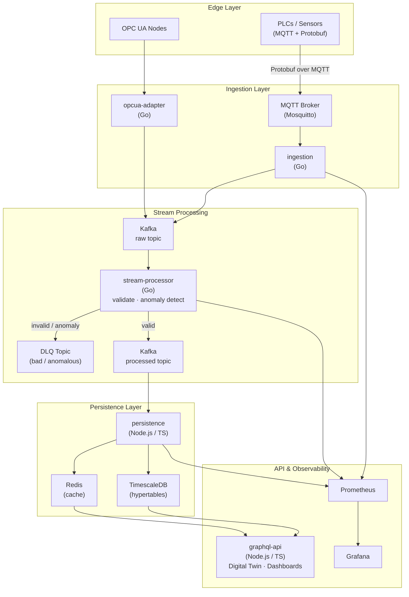

# SentinelFlow

**Industrial-grade IIoT telemetry platform for factory-floor monitoring at scale.**

SentinelFlow ingests high-frequency sensor data from thousands of PLCs and OPC UA nodes, validates and enriches it in real time, and serves it through a GraphQL API powering Digital Twin dashboards — all with sub-second latency and graceful degradation when infrastructure hiccups.

[](https://github.com/vgandhi1/SentinelFlow/actions/workflows/ci.yml)


---

## Architecture



---

## Services

| Service | Language | Responsibility |
|---------|----------|----------------|
| [`ingestion`](services/ingestion/) | Go | MQTT listener → deserialize Protobuf → publish to Kafka with backpressure & worker pool |
| [`stream-processor`](services/stream-processor/) | Go | Consume raw topic → validate schema → Z-score anomaly detection → route to processed or DLQ |
| [`persistence`](services/persistence/) | TypeScript | Consume processed topic → write time-series rows to TimescaleDB → cache hot keys in Redis |
| [`opcua-adapter`](services/opcua-adapter/) | Go | Poll OPC UA nodes → normalize → publish to Kafka raw topic |
| [`graphql-api`](services/graphql-api/) | TypeScript | GraphQL over TimescaleDB + Redis — serves Digital Twin UI and dashboards |

---

## Quick Start

```bash
# Bring up Kafka, MQTT, TimescaleDB, Redis, Prometheus, Grafana
docker-compose up -d

# Run the ingestion edge service
cd services/ingestion && go run main.go

# In another terminal — stream processor
cd services/stream-processor && go run main.go

# Persistence consumer
cd services/persistence && npm install && npm start
```

**Observability** is available immediately after `docker-compose up`:

| Tool | URL | Credentials |
|------|-----|-------------|
| Grafana | http://localhost:3000 | `admin` / `admin` |
| Prometheus | http://localhost:9090 | — |

Dashboards and alert rules are pre-provisioned under `deploy/observability/`.

---

## Repository Layout

```
SentinelFlow/
├── api/proto/              # Protobuf definitions (telemetry schema)
├── services/
│   ├── ingestion/          # Go — MQTT → Kafka edge service
│   ├── stream-processor/   # Go — validation, anomaly detection, DLQ
│   ├── persistence/        # TS  — Kafka → TimescaleDB + Redis
│   ├── opcua-adapter/      # Go — OPC UA → Kafka
│   └── graphql-api/        # TS  — GraphQL API (Digital Twin)
├── deploy/
│   ├── observability/      # Prometheus, Grafana, alert rules
│   └── mosquitto.conf      # MQTT broker config
├── docs/                   # Design docs, reliability, roadmap
└── docker-compose.yml
```

---

## Reliability

- **Local spooling** (BadgerDB) on Kafka outage — no data loss at the edge
- **DLQ** for validation failures and anomalies — replayable, observable
- **Redis fallback** when TimescaleDB write latency spikes
- **Adaptive sampling** and circuit breakers under sustained load
- **Graceful shutdown** with in-flight message draining

Full details in [docs/RELIABILITY.md](docs/RELIABILITY.md).

---

## Development

```bash
# Go services
golangci-lint run ./...
go test ./...

# TypeScript services
npm run lint
npm test
```

See [docs/CONTRIBUTING.md](docs/CONTRIBUTING.md) for branching, PR, and testing conventions.

---

## Roadmap

See [docs/ROADMAP.md](docs/ROADMAP.md). Near-term priorities include schema registry integration, per-sensor rate limiting, and a React Digital Twin frontend.
